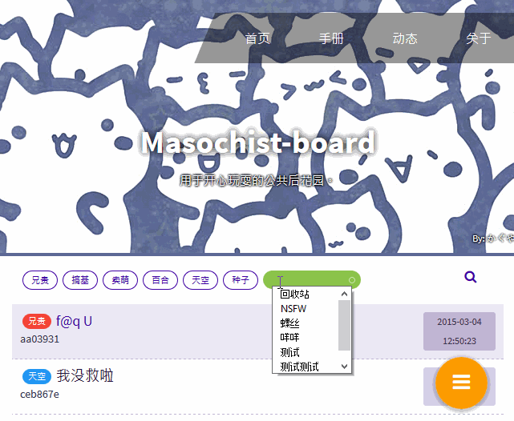
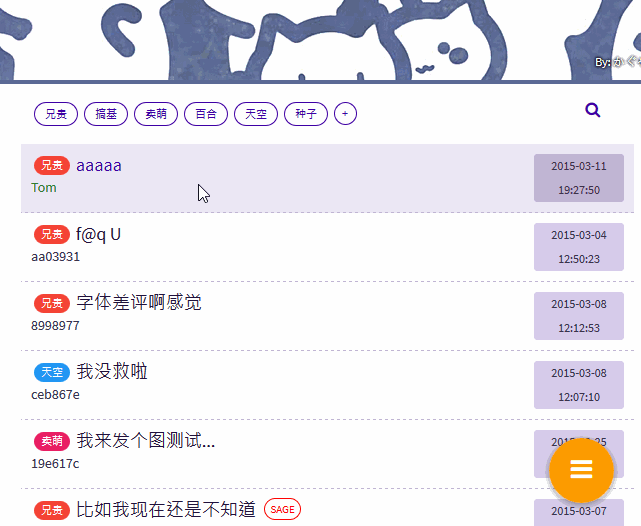

# 管理您的 Masochit-board

您可以通过访问网站根目录 #/manage/login 以管理员的身份进行登录。
或者在任意页面下按下这个按键组合："上上下下左右左右BA"进行登录。

登录后页面会更新为管理者视图，右下角的发表内容按钮的样式会变为汉堡包，鼠标指向汉堡包后会弹出管理菜单。

##对分类进行操作##

如果想对某一分类进行管理，您可以将鼠标指向这一分类，分类右侧会出现小圆圈。再将鼠标指向小圆圈，会弹出对应该分类的管理功能托盘，您可以对此分类进行隐藏、禁言、重命名操作。

如果您想要添加一个新的分类，您可以将鼠标指向"➕"，录入新分类的名字，鼠标指向右侧的小圆圈，会弹出调色盘，在调色盘中选择一个颜色，点击它，一个分类就创建完了。

出于安全考虑，我们不在api或前端提供删除分类的功能，如有特殊需求请执行如下SQL命令：

删除某分类的所有内容：

    DELETE FROM `content` WHERE `category` = '『分类ID』'

删除某一分类：

    DELETE FROM `category` WHERE `id` = '『分类ID』'

##对发表的内容进行操作##

###删除内容###

想要删除某一个主题，您可以选择进入该主题，将鼠标指向右下角的 Action button，呼出菜单，点击垃圾桶图标并删除，或者单击某一个主题，这时该主题会变为高亮，选中多个主题后，进行批量删除操作。

对于大规模删除操作，我们推荐您通过执行MySQL语句实现，在这里我们提供一个范例：

    DELETE FROM `content` WHERE `title` = '肛死腹部姬！！！biu————————————'
    
###转移分类###

您可以将某一主题从一个分类转移至另一个分类，进入某一主题，或者通过多选的方式选择某几个主题，将鼠标移动到右下角的公交车图案上，会弹出一个小气泡。点击气泡呼出分类列表，选中一个分类并确认，就可以将某一主题转移到新的分类中了。

###SAGE###

sage是指用户可以回复某一po，但是回复完毕后此po不会上浮到顶端~~以达到隐藏福利内容的目的~~。

用户可以选择自行对自己的内容进行sage，管理员也可进行该操作。在右下角的管理菜单中选择sage即可。

##如何实现多个管理员？##

您可以到插件市场下载TransformMonkey插件，另外我们还提供了为不同管理员名称显示不同颜色的插件ColorfulMonkey。